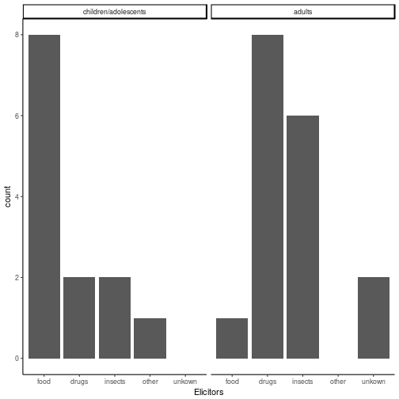

Refractory anaphylaxis cases in the Registry
========================================================
author: W. Francuzik
date: 11.04.2018
autosize: true

Description
========================================================

- New data base is not yet incorporated in this analysis
- we may see more cases with the new database

Definition of refractory anaphylaxis
========================================================

**Theory - ideal definition:**

- at least two doses of adrenaline (of at least 300 µg)
- without "adequate" clinical response

**Reality - what we can use from the register:**

- at least two doses of adrenaline (dose not availible)
- AND:
  - death
  - severe reaction that required hospitalisation

**Even now we are uncertain that all were refractory**

How many patients with adrenalin doses?
========================================================

|   | count|
|:--|-----:|
|0  |  8280|
|1  |  1708|
|2  |   167|
|3  |    52|
|4  |     5|

How severe  (in Ring and Messmer) were the cases where repeated adrenalin was needed
=============================

|   | grade I| grade II| grade III| grade IV|
|:--|-------:|--------:|---------:|--------:|
|0  |     645|     4463|      2966|      116|
|1  |      43|      721|       853|       81|
|2  |       0|       52|       100|       14|
|3  |       0|       10|        27|       15|
|4  |       0|        2|         2|        1|

Fatalities in the cases of repeated adrenalin
=========================

|   |   no| yes|
|:--|----:|---:|
|0  | 8274|   6|
|1  | 1701|   7|
|2  |  165|   2|
|3  |   48|   4|
|4  |    5|   0|

First part of the definition death and two doses of adrenalin.

Which drugs were given as a "second line treatment" in repeated cases of refractory anaphylaxis?
=======================

|x                   |
|:-------------------|
|q_552_antih_iv_v5   |
|q_552_beta2_iv_v5   |
|q_552_dopamine_v5   |
|q_552_glucagon_v5   |
|q_552_cortico_iv_v5 |
|q_552_methyleneb_v5 |
|q_552_theo_iv_v5    |
|q_552_volume_v5     |

How many drugs were given in these cases?
===================

|   |    0|   1|   2|  3|
|:--|----:|---:|---:|--:|
|0  | 7919| 148| 162| 51|
|1  | 1499| 110|  74| 25|
|2  |  134|  13|  13|  7|
|3  |   23|  15|   8|  6|
|4  |    1|   0|   4|  0|

And if we only restrict these to grade IV cases?
============================

top: number of emergency drugs

left: number of adrenalin doses

|   |   0|  1|  2|  3|
|:--|---:|--:|--:|--:|
|0  | 110|  1|  4|  1|
|1  |  74|  2|  5|  0|
|2  |  12|  2|  0|  0|
|3  |   8|  4|  0|  3|
|4  |   0|  0|  1|  0|

Were these patients addmitted to the hospital?
===========================

|   | no treatment|   no|  yes| unknown|
|:--|------------:|----:|----:|-------:|
|0  |          489| 1818| 1532|     431|
|1  |            0|  296|  737|      42|
|2  |            0|   13|   94|       2|
|3  |            0|    5|   35|       0|
|4  |            0|    0|    4|       0|

Second part of the definition: hospital addmission. Some patients that reacted severly and were admitted to the hospital AND recievied 2 and more doses of Adrenalin - had in fact  correct response to adrenalin.
These cases can not be identified using the data from our register.

Result: Age and elicitor description of these refractory cases
==============================

|        | children 0-11| adolscents 12-17| young adults 18-44| older adults 45-64| seniors 65+|
|:-------|-------------:|----------------:|------------------:|------------------:|-----------:|
|food    |             1|                7|                  1|                  0|           0|
|drugs   |             1|                1|                  2|                  4|           2|
|insects |             0|                2|                  1|                  4|           1|
|other   |             0|                1|                  0|                  0|           0|
|unkown  |             0|                0|                  1|                  1|           0|

Conclusion
============

- Definition is just a hint that these cases could be refractory
- manual verification of ceach case would be necessary
- We know nothing about the sensitivity of this definition
- Further analysis according to cofactors, symptoms and detailed triggers follows.

