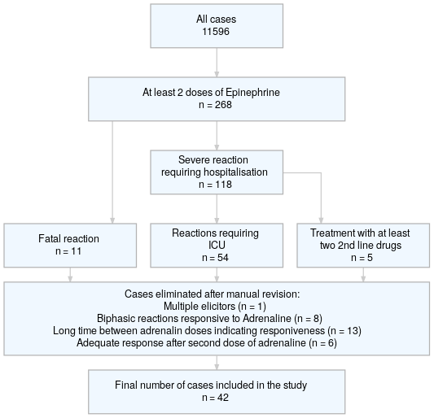
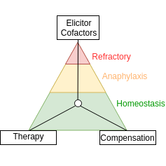

<!-- This is the format for text comments that will be ignored during renderings. Do not put R code in these comments because it will not be ignored. -->

```{r, setup, echo = FALSE,warning=FALSE,message=FALSE}
knitr::opts_chunk$set(
  collapse = TRUE,
  warning = FALSE,
  message = FALSE,
  echo = FALSE,
  comment = "#>",
  fig.path = "../figures/"
)

library(RefractoryAnaOrg) # Or use devtools::load_all('.', quiet = T) if your code is in script files, rather than as functions in the `/R` diretory
require(magrittr)
options(scipen=1, digits=4)
#require(pander)
#panderOptions('digits', 2)
#panderOptions('round', 2)
#panderOptions('keep.trailing.zeros', TRUE)
```

```{r}
periopAna <- data3$rANA[which(data3$q_152_location=="medical practice, hospital")] %>% 
  as.factor %>%  summary()
nperiopAna <- data3$rANA[which(data3$q_152_location!="medical practice, hospital")] %>% as.factor %>% summary 

```


^1^ Department of Dermatology, Venerology and Allergology, Charité – Universitätsmedizin Berlin, corporate member of Freie Universität Berlin, Humboldt-Universität zu Berlin, and Berlin Institute of Health, Charitéplatz 1, 10117 Berlin,

^2^ Department of Dermatology and Allergology, Klinikum der Universität München, Munich, Germany

^3^ Department of Dermatology, University Hospital Basel, Basel, Switzerland

^4^ Department of Pediatrics, Jagiellonian University Medical College, Krakow, Poland 

^5^ Service of Allergology, Complejo Hospitalario de Navarra, Pamplona, Spain

^6^ Department of Dermatology, Paracelsus Private Medical University Salzburg, Salzburg, Austria

^7^ Bon Secours Hospital, Cork/Department of Paediatrics and Child Health, University College Cork, Ireland

^8^ Réseau d’Allergo-Vigilance (Allergy Vigilance Network), Vandoeuvre les Nancy, France

**Corresponding author: **
Prof. Dr. med. M. Worm margitta.worm@charite.de
Phone: +49 30 450 529 005;	  Fax: +49 30 450 529 902


**Keywords:** 
anaphylaxis, adrenaline (epinephrine), beta-blockers, insect venom allergy, drug allergic reactions, vasopression, refractory


# Abstract
<!-- 350 Words unstructured -->
Refractory anaphylaxis (unresponsive to treatment with at least 2 doses of minimum 300 µg adrenaline) is a rare and often fatal hypersensitivity reaction. Comprehensive data on its definition, prevalence, and risk factors are missing. Using the data from the European Anaphylaxis Registry (`r v$allCases` cases in total) we identified refractory anaphylaxis cases (n = `r v$casesR`) and analyzed these in comparison to a control group of severe anaphylaxis cases (n = `r v$casesC`).

The data show that drugs more frequently elicited refractory anaphylaxis (`r elicitorTab[elicitorTab$Elicitor=="drugs","percent"]`% of cases, p < 0.0001) compared to other severe anaphylaxis cases (`r elicitorTab[elicitorTab$Elicitor=="drugs","percANA"]`%).  Cases elicited by insects (n = `r sum(v$casesInsect)`) were more often due to bees than wasps in refractory cases (`r 5/8*100`% vs `r round(449/(77+1607+4+9+170+3+449)*100,1)`%, p = `r fisher.test(matrix(c(449,5,77+1607+4+9+170+3,3),nrow=2))$p.value %>% round(3)`). The refractory cases occurred mostly in a perioperative setting (`r v$perioperative[3]`% vs. `r v$perioperative[2]`, p < 0.0001). Intramuscular adrenaline (as a first line therapy) was administered in `r therapyTab[1,3]`% of refractory cases, whereas in `r therapyTab[2,3]`% of cases it was applied intravenously (significantly more often than in severe anaphylaxis cases: `r therapyTab[2,2]`%, p < 0.0001). Second line treatment options (e.g. vasopression with dopamine, methylene blue, glucagon) were not used at all for the treatment of refractory cases. The mortality rate in refractory anaphylaxis was significantly higher (`r v$mortality[3]`%) than in severe cases (`r v$mortality[2]`%, p < 0.0001).

Refractory anaphylaxis is associated with drug induced anaphylaxis in particular if given intravenously. Although adrenaline (even i.v.) is frequently applied in these patients, not all patients are responding. Whether a delay in recognition of anaphylaxis is responsible for the refractory case or whether these cases are due to an overflow with mast cell activating substances - requires further studies. Reasons for the low use of second line medication (i.e. methylene blue or dopamine) in refractory cases are unknown, but their use might improve the outcome of severe refractory anaphylaxis cases.


# Introduction

Anaphylaxis is a non-homogeneous clinical diagnosis, depending on various triggering and augmenting factors [@Simons2015]. This variability introduces a wide range of possible reaction-symptom severities. Therefore, multiple sub-types of anaphylaxis have been previously identified (i.e. food dependent exercise induced anaphylaxis, venom anaphylaxis, biphasic anaphylaxis). 

The mainstay of anaphylaxis management is the intramuscular dose of adrenaline [@Grabenhenrich2018], but in the most severe cases of anaphylaxis it might be insufficient to restore a stable patient status. Refractory anaphylaxis (although the established definition is lacking) might be defined as anaphylaxis meeting the criteria by NIAID/FAAN [@Sampson2006] which, after the treatment with at least 2 doses of minimum 300 µg adrenaline, does not achieve normalization of the clinical symptoms in a given individual. Typical elicitors and symptoms of refractory anaphylaxis, as well as the therapeutic strategy for the most severe cases, differ from the usual reactions [@Francuzik2018] and call for a specific research and targeted guideline development for refractory anaphylaxis cases.

We aimed to distinguish the prevalence of refractory anaphylaxis among anaphylaxis cases and to describe symptoms and factors which may increase the risk of a refractory anaphylaxis episode. 


# Methods
The European Anaphylaxis Registry (described in detail elsewhere [@Grabenhenrich2016]) provided data for this analysis status from March 2018.  We selected cases where patients received at least two doses of adrenaline, and failed to recover adequately and assigned them to the "refractory anaphylaxis group". The flowchart in figure \@ref(fig:flowchart) represents the detailed cases selection process. 

The final database consisted of `r sum(countries)` cases of refractory anaphylaxis from `r length(countries)` countries: `r paste0(names(countries[order(countries,decreasing = T)]),": ",countries[order(countries,decreasing = T)],collapse=", ")`. We compared these to a group of severe, non-refractory cases of anaphylaxis. Severe reactions were identified based on the definition by NIAID/FAAN [@Sampson2006] and presented with significant hypoxia, hypotension, confusion, collapse and loss of consciousness, or incontinence. 
We compared the frequency of various elicitors, symptoms, and factors known to increase the risk of severe anaphylaxis [@Worm2018] in both groups. We also analyzed how the cases were managed.

<!-- ## Data handling and statisitcs -->
The statistical analysis was performed in the R Statistical Package [@R]. Simple comparison of categorical variables was performed using Fisher's exact test, continuous variables were analyzed using Mann-Whitney U test. We defined statistical significance as α = 0.05. Data along with the analysis script can be accessed at www.github.com/wolass/RefractoryAnaOrg.

# Results

<!-- ## Demographics -->
## Refractory anaphylaxis accounts for less than 0.5% of severe anaphylaxis cases in the register

The European Anaphylaxis Registry captured `r {data3[,"rANA"]=="yes"} %>% which %>% length` cases of refractory anaphylaxis and `r {data3[,"rANA"]=="no"} %>% which %>% length` severe, non-refractory anaphylaxis. The frequency of refractory anaphylaxis was `r ((data3$rANA=="yes") %>% which() %>% length / (data3$d_year_reaction %in% 2007:2017) %>% which() %>% length ) %>% {.*100} %>% signif(2)`% of all anaphylaxis cases reported in the registry. Each year approximately 1% (`r table(data3$d_year_reaction, data3$rANA) %>% {cbind(.[,1]/(.[,1]+.[,2]),.[,2]/(.[,1]+.[,2]))[which(rownames(.) %in% 2007:2017),2]} %>% {paste0(mean(.) %>% signif(3)*100, "% $\\pm$ ", sd(.) %>% signif(3)*100,"%")}`) of severe anaphylactic episodes are refractory to treatment with adrenaline. When considering patients who experienced anaphylaxis in a perioperative setting or a medical facility, nearly `r (periopAna[2]/(periopAna[2]+periopAna[1])) %>% signif(3)*100`% patients present with reactions that do not respond to adrenaline vs. `r (nperiopAna[2]/(nperiopAna[2]+nperiopAna[1])) %>% signif(3)*100`% in non-medical setting (`r 3.72/0.448 %>% signif(1)` times more). 

## Increased Frequency of previous reactions in patients with refractory anaphylaxis

The mean age at the reaction was `r {data3$d_age[data3[,"rANA"]=="yes"]} %>% mean(na.rm=T) %>% signif(3)` ± `r data3$d_age[data3[,"rANA"]=="yes"] %>% sd(na.rm=T) %>% signif(3)` years, which did not differ from severe, non-refractory cases, p = `r t.test(data3$d_age[data3[,"rANA"]=="yes"],data3$d_age[data3[,"rANA"]=="no"])$p.value %>% signif(3)`).
The percentage of males within the refractory anaphylaxis group was `r (as.numeric(demoTab[2,2])/sum(as.numeric(demoTab[2,2])+as.numeric(demoTab[1,2]))*100) %>% {round(.,1)}`%. More patients suffered from a concomitant malignant disease in the refractory anaphylaxis group. Most strikingly, patients with refractory reactions more often had a previous anaphylactic reaction in their medical history (p = `r data3$q_410_prev_v5 %>% table(data3$rANA) %>%{.[1:2,]} %>% fisher.test() %>% {.$p.value} %>% signif(3)`). Baseline tryptase levels were significantly higher in the refractory anaphylaxis group as 7 refractory patients (`r {7/41*100} %>% round(1)`%) had tryptase level above 11.5 µg/L (vs. `r summary(sdb$d_210_tryptase_cat) %>% {.[2]/sum(.[1:3])} %>% {.*100} %>% round(1)`%)). The demographic summary of refractory cases is shown in table \@ref(tab:demoTab). 

<!-- # ## Elicitors -->
## Drugs are the most frequent elicitors of refractory anaphylaxis

```{r}
locTab <- data3$q_152_location %>% table(data3$rANA)
 # data3$rANA[which(data3$q_152_location=="medical practice, hospital")] %>% as.factor %>%  summary()
```

Refractory anaphylaxis was most commonly elicited by drugs (significantly more often than in severe, non-refractory cases), followed by food and insects (table \@ref(tab:elicitorTab)). The most common drugs eliciting anaphylaxis refractory to adrenaline were antibiotics (`r elicitExact[1,3]`%) and radiocontrast media (RCM, `r elicitExact[2,3]`%). Patients with refractory anaphylaxis more frequently experienced the reaction while undergoing a medical procedure (`r (locTab[3,2]/sum(locTab[,2])*100) %>% {signif(.,3)}`% vs. `r (locTab[3,1]/sum(locTab[,1])*100) %>% {signif(.,3)}` in severe, non-refractory cases, p < 0.0001) 


`r elicitorTab[1,8]`% of food elicited refractory cases had a previously confirmed diagnosis of food allergy. Severe cases of anaphylaxis were most frequently elicited by insects and food triggers.
Insect-venom-elicited, refractory cases were significantly less often elicited by yellow-jacket-stings (but not by bee-stings) than severe, non-refractory cases (table \@ref(tab:elicitExact)). 

## Refractory anaphylaxis is life-threatening
<!-- ## Symptoms -->
Milder anaphylaxis symptoms (i.e. pruritus, gastrointestinal symptoms, vertigo, chest and throat tightness) were significantly less present in refractory anaphylaxis cases, whereas respiratory and cardiac arrest, as well as inspiratory and expiratory distress, and death were more often associated with the refractory anaphylaxis cases. Table \@ref(tab:symptTab) summarizes the most prominent differences in anaphylaxis symptoms among both groups.
<!-- ## Death  -->
Fatal reactions frequently occurred 30 minutes to 120 minutes after exposure - when the cardiopulmonary resuscitation was unsuccessful and were highly associated with refractory cases (`r rcalc("q_140_fatal")[3]`% vs. only `r rcalc("q_140_fatal")[2]`% of severe anaphylaxis cases, p < 0.0001) In cases where patients responded to life support, but failed to be reanimated due to post-resuscitative complication (e.g. hypoxic brain injury), death occurred in the next 3-8 days. 

<!-- ## Therapy -->
## Adrenaline i.v. as first-line treatment was given frequently in refractory anaphylaxis

```{r}
med.time2 <-data3$q_530_adren2_time_in_min_v5 %>% as.character() %>% as.numeric %>% split(data3$rANA) %>% lapply(median, na.rm=T)
med.timep<- data3$q_530_adren2_time_in_min_v5 %>% as.character() %>% as.numeric %>% 
  {wilcox.test(.[data3$rANA=="no"],.[data3$rANA=="yes"])}
adr2prof <- rcalc("q_530_adren2_who_v5","professional")

```

When evaluating the therapeutic procedures, adrenaline i.v. as a first-line treatment of anaphylaxis was significantly more often given in refractory cases (`r therapyTab[2,3]`% vs. `r therapyTab[1,3]`%, p < 0.0001). Median time to the second dose of adrenaline was also shorter in refractory cases (`r med.time2[[2]]` minutes vs. 15 minutes in non-refractory cases, p <0.0001). 
<!-- `r med.timep$p.value %>% signif(3)`). -->
<!--  wilcox.test(data3$q_530_adren2_time_in_min_v5[data3$rANA=="yes"],data3$q_530_adren2_time_in_min_v5[data3$rANA=="no"])$p.value %>% signif(3)-->
<!--In `r adr2prof[3]`% of refractory cases, the second dose of adrenaline was given by a professional (significantly more than in non-refractory cases `r adr2prof[2]`%, p < 0.0001).  -->

Corticosteroids i.v. were the second most frequently administered group of drugs in refractory cases (as a first and second line treatment), outpacing antihistaminic drugs and volume replacement therapy, and were significantly more often given in refractory cases. Volume replacement therapy was given initially in `r therapyTab[4,3]`% of refractory cases and was sustained only in `r therapyTab[5,3]`% as the therapy progressed in the hospital environment. 
<!--(possible counfounding variable by patients who died!!! they did not receive second line therapy and might need to be discarded from the analysis)--> 

Second line medication like dopamine, glucagon and methylene blue were not given in all refractory anaphylaxis cases as well as in severe non-refractory ones. However, patients with refractory anaphylaxis were more frequently admitted to the hospital (`r therapyTab[18,3]`%) and treated at the ICUs (`r therapyTab[19,3]`%). Table \@ref(tab:therapyTab) illustrates the therapy of refractory anaphylaxis cases.

## Cofactors of refractory anaphylaxis
<!-- ## Cofactors -->
Patients with refractory anaphylaxis more often had concomitant asthma and malignant diseases in their medical history. Also other unspecified concomitant conditions were significantly more often reported in refractory cases. Concomitant cardiologic conditions, diabetes and mastocytosis were similarly frequent in both groups.  

Patients with refractory anaphylaxis more often reported concomitant intake of proton pump inhibitors (PPI) and acetylsalicilic acid (ASA) compared with patients with severe non-refractory anaphylaxis. Other (not specified) medications were also more frequent in refractory cases. In `r table(data3$rANA,data3$q_423_beta)[2,2]` cases of refractory anaphylaxis (`r (table(data3$rANA,data3$q_423_beta)[2,2]/sum(table(data3$rANA,data3$q_423_beta)[2,1:3])*100) %>% round(1)`%) patients reported receiving beta-blockers as a concomitant medication, but none of these patients received a glucagon infusion.

The intensity of physical exercise exceeding the reaction was indifferent between groups, however psychological burden (defined as stressfull event preceeding the reaction, rated by the physician) was reported 3 times more frequently in refractory cases (see table \@ref(tab:cofactorsTab)).

```{r}
#data3$q_410_other_codisease_free[which(data3$rANA=="yes")]
#rcalc("q_4212_exercise_intensity","moderate eg. vigorous housework or gardening")
#data3$q_423_other_drug_free[which(data3$rANA=="yes")] 

```


# Discussion

## Frequency of refractory anaphylaxis and patients at risk
Our findings suggest that around 1 in 100 severe anaphylaxis patients will not respond to the standard therapy with adrenaline, commonly outlined in anaphylaxis management guidelines [@Muraro2014]. Such cases have the highest risk of a fatal outcome, and therefore need to be treated accordingly. An early use of adrenaline and maybe other second line drugs (e.g. methylene blue and dopamine) might increase their survival chance. 

Overall, the severity of anaphylaxis and its probable transition into a refractory episode might be described by several co-influencing mechanisms: 
1) elicitors - the type and dose of an eliciting agent and route of exposure; 
2) cofactors - the presence of other individual and external factors which may increase the severity of a given reaction i.e. concomitant use of a beta-blocker etc.;
3) compensation - how well the affected individual can compensate reaction symptoms e.g. hypotension; 
4) therapy - how fast and accurately the therapeutic interventions were applied (Fig. \@ref(fig:theory)).
<!-- This theory might explain why younger patients are able to better compensate the same trigger which would elicit a refractory reaction in eldery patients.  -->

## Elicitors
Drugs were the most commonly occurring elicitor, which is in concordance with the literature and our previous findings [@Francuzik2018]. Multiple medications with mast cell activation potential [@Hepner2003] given in a perioperative setting increase the chance of a hypersensitivity reaction and drug interactions [@Ebo2007]. A recent study on IgE-independent anaphylaxis showed that perioperative drugs (i.e. rocuronium, turbocurarine, fluorochinolones, atracurium) may trigger anaphylaxis by activating mast cells directly through the MRGPRX2 receptor [@Mcneil2015]. Therefore, patients undergoing surgical procedures and having a history of anaphylaxis should remain under extraordinary caution. 

Antibiotics, although commonly triggering IgE-dependent reactions [@saxon1983], are rarely reported in the literature as the cause of a refractory anaphylaxis. RCM on the other hand, commonly elicit IgE-independent hypersensitivity episodes that are refractory to adrenaline and are responsible for 1-5 deaths per 100,000 administrations  [@Greenberger1991]. We previously reported RCM to be the most frequent elicitor of refractory anaphylaxis [@Francuzik2018]. It might be that RCM promote  complement activation [@Wang2011] and thus - unspecific activation of multiple immune cell classes (mast cells, basophils, platelets and neutophils). Therefore, treatment with adrenaline may be less effective in these reactions.

Only few refractory cases were elicited by yellow-jacket-stings. Therefore, the ratio of yellow-jacket to honey-bee venom elicited anaphylaxis was inverted in the refractory group. Reasons for this observation might include higher allergen exposition due to either longer exposition to the allergen (bee's sting remains in the skin) or the venom volume being 10 times higher than in a wasp sting [@Visscher1996].
<!-- Patients should remove the bee sting as quickly as possible (optimal < 2 seconds) . -->

<!-- Mastoparans are a potent family of mast cell activators through G-protein coupled receptors (GPCRs). It is likely that their affinity to GPCRs might vary and the composition of mastoparans might depend on the species [source].   -->

<!-- Carpa ???-->

## Risk factors 
Although we have previously identified higher age and male sex to be associated with severe anaphylaxis [@Worm2018], these factors seem to be less important when refractory anaphylaxis is considered. By contrast, concomitant asthma was previously associated with less severe anaphylaxis in our registry data [@Worm2018]. However, the present analysis as well as other previous data [@Mullins2003] suggest concomitant asthma as a risk factor for a severe episode. Probably the control of the asthmatic condition is essential in this context and should be therefore evaluated in patients at risk. Moreover, it might be possible that during a refractory episode the bronchospasm is additionally triggered via mediators derived from basophils and eosinophils or the vegetative nerve system what makes it refractory to adrenaline and results in a prolonged anaphylactic episode. Following this line we observed more respiratory distress symptoms in the refractory anaphylaxis cases.

<!-- Is it possible that the cancer drugs made them more susceptible to refractory anaphylaxis? -->
```{r}
temp <- data3[data3$rANA=="yes",]
mean_age_malig <- data3$d_age %>% split(data3$q_410_malig_prev_v5 %>% factor) %>% lapply(mean)
```
The higher rate of malignancy in patients with refractory anaphylaxis diseases might be a confounder as certain chemotherapeutics are given intravenously and are well known to activate mast cells (e.g. taxanes) [@lee2009].
On the other hand, it is possible that patients with reported malignancies were older (mean age of `r mean_age_malig[[1]] %>% round(1)` vs `r mean_age_malig[[2]] %>% round(1)` years, p <  0.001) and therefore less able to compensate the anaphylactic shock.

Psychological stress in temporal proximity to the reaction might increase the severity of the reaction as we previously reported [@Worm2018]. Stress induces the complement cascade activation [@Burns2008]. Substance P, which is released during stress [@Arck2003], is a known vasodilator  [@Bos92] and can activate mast cells directly [@Singh1999]. These mediators may contribute to an increased mast cell response and more severe anaphylaxis.  Some published case reports indicated for stress as the anaphylaxis trigger [@alevizos2014].

The role of PPI as a risk factor for severe anaphylaxis has been indicated in prolonging the exposition to an oral allergen (preventing its degradation due to lower gastric acid production) [@Wlbing2013]. Moreover, there are reports on PPI themselves as elicitors of anaphylaxis @Natsch2000]. We observed a significantly higher rate of PPI intake in the refractory anaphylaxis group. Its mechanistic contribution to the increase in severity of an episode or being responsible for its refractoriness cannot be estimated based on this observation.

<!--Low-Dose Ethanol Alters the Cardiovascular, Metabolic, and Respiratory Compensation for Severe Blood Loss-->

## Symptom compensation
Age is the most important factor influencing the risk of developing severe anaphylaxis [@Worm2018]. We and others have shown that older age may correlate with the decreased abillity to retain homeostasis on increased strain [@fleg1995].
Patients who underwent refractory anaphylaxis more often had perioperative reactions  and therefore a decreased ability to compensate the reaction symptoms with reflexory renal or cardiopulmonary response [@Rogers2013]. 

Compensation mechanisms demonstrated in animal models indicated that anaphylactic hypotension activates the hypothalamic paraventricular nucleus, medullary nucleus tractus solitarii and rostral ventrolateral medulla, independently of the baroreflex pathway. Further, it stimulates efferent sympathetic nerve activity to the adrenal gland and kidney to restore blood pressure [@tanida2018]. 

## Therapy 
<!-- After revising the therapeutic procedures 

We saw significantly more adrenaline use in the refractory cases, but it could have been used even more extensively in these life-threatening reactions. This observation might indicate that in fact the emergency teams are using these life-saving measures too cautiously.  -->


Adrenaline i.v. as first-line therapy use was high in the refractory cases. This was probably due to the fact that most of them occur in a medical setting. However, other second-line therapeutic options were rarely used. Grabenhenrich et al. [@Grabenhenrich2018] recently evaluated the epinephrine use in anaphylaxis patients and concluded that, even in this state of the art drug, large discrepancies between recommended use and actual treatment practice exist. Similarly, US studies documented poor adherence in patients and caregivers to anaphylaxis guidelines recommending more than 1 adrenaline autoinjector available at all times [@song2018]. 
Therefore, more effort needs to be dedicated to promote and develop the consensus guidelenes as practically as possible in order to increase adherence. 

Methylene blue and vasopressors have been described to successfully restore refractory hypotension and recommended by managment guidelines [@Muraro2014], but their actual use in anaphylaxis patients is scarce. There are multiple reports of successful methylene blue use in refractory anaphylaxis [@Francuzik2018]. Evora [@Evora2000] reported 6 cases of refractory, peroperative anaphylaxis (to RCM and penicillin) which responded to methylene blue i.v. within minutes. Methylene blue blocks the guanylate cyclase and therefore prevents further nitric-oxide-dependent vasodilation in a distributive shock [@dfaz]. Its potential role in neuroprotection has also been indicated [@tucker2017].
  
Suprisingly, even though multiple anaphylaxis management guidelines recommend glucagon infusions in cases of concomitant beta-blocker therapy in anaphylactic patients [@Simons2011;@Lieberman;@Muraro2014], it has not been administered in any of the severe or refractory cases. Similarly, Royal Collage of Anesthetists reported one glucagon administration in 266 severe intraoperative anaphylaxis episodes [@harper2018]. Glucagon has been reported to sucessfully relive refractory anaphylaxis [@Zaloga1986;@Javeed1996] by directly activating the adenylyl cyclase and therefore bypassing the β-adrenergic receptor blockade [@Zaloga1986].   

## Limitations and strengths
The low number of refractory cases prevented us from analyzing the data with more advanced statistical models. However, our analysis is the first report on a patient cohort exceeding 30 refractory anaphylaxis cases.

There is no universal definition  of refractory anaphylaxis is not universal. The confirmation ofrefractory anaphylaxis is based on the answers to our online questionnaire. If a fatal reaction occurred before the second dose of adrenaline was administered to the patient - it was not categorized as refractory (as we defined at least two doses of minimum 300 µg adrenaline for refractory anaphylaxis) although, it in fact might have been refractory. 

The comparison of refractory anaphylaxis with patients suffering from severe anaphylaxis enabled us to distinguish patients with a higher risk of developing a refractory episode. However we cannot address the question which patients had a higher risk of experiencing anaphylaxis per se. 

## Conclusion

Refractory anaphylaxis is a rare form of a life-threatening hypersensitivity reaction with high mortality. Its elicitors and cofactors differ from other anaphylaxis cases, and the management of refractory anaphylaxis needs to improve. Although, more studies need to be conducted to better understand the pathomechanisms involved in refractory anaphylaxis, we propose to increase the use of second line medication such as methylene blue, vasopressin and (in suspicion of a beta adrenergic blockade) glucagon in cases where 2 doses of adrenaline did not result in a rapid normalization of anaphylaxis symptoms. 

# Acknowledgements
We thank all patients, parents, and their children for their support in providing data on the
occurrence of anaphylaxis for this study. We thank the study personnel for patients
counseling and data entry and we thank the members of The European Anaphylaxis Registry
in detail:
J. Grünhagen (Berlin, Germany),
K. Beyer (Berlin, Germany),
A. Möser (Jena, Germany),
T. Fuchs (Göttingen, Germany),
F. Ruëff (Munich, Germany),
B. Wedi (Hanover, Germany),
F. Friedrichs (Aachen, Germany),
H. Dickel (Bochum, Germany),
H. Merk (Aachen, Germany),
U. Hillen (Essen, Germany),
A. Bauer (Dresden, Germany),
N. Wagner (Erlangen, Germany),
E. Rietschel (Cologne, Germany),
R. Treudler, S. Aurich (Leipzig, Germany),
L. Klimek, O. Pfaar (Wiesbaden, Germany),
N. Reider (Innsbruck, Germany),
W. Aberer (Graz, Austria),
A. Köhli (Zurich, Switzerland),
F. Riffelmann (Schmallenberg, Germany),
B. Kreft (Halle, Germany),
K. Nemat (Dresden, Germany),
T. Kinaciyan (Vienna, Austria),
R. Brehler (Münster, Germany),
J. Witte (Hamburg, Germany),
N. Hunzelmann und I. Huseynow (Cologne, Germany),
T. Bieber (Bonn, Germany),
U. Rabe (Treuenbritzen, Germany),
P. Schmid-Grendelmeier (Zurich, Switzerland),
W. Brosi (Würzburg, Germany),
S. Nestoris (Lippe-Lemgo, Germany),
T. Hawranek (Salzburg, Austria),
R. Bruns (Greifswald, Germany),
S. Lehmann (Aachen, Germany),
L. Lange (Bonn, Germany),
G. Hansen (Hanover, Germany),
C. Pföhler (Homburg, Germany),
E. Varga (Graz, Austria),
Z. Szepfalusi (Vienna, Austria),
P. Eng (Aarau, Switzerland),
P. Eng (Lucerne, Switzerland),
T. Reese (Rheine, Germany),
M. Polz (Rüsselsheim, Germany),
S. Schweitzer-Krantz (Düsseldorf, Germany),
H. Rebmann (Tübingen, Germany),
G. Stichtenoth (Lübeck, Germany),
S. Theis (Schwedt, Germany),
I. Yildiz (Neumünster, Germany),
M. Gerstlauer (Augsburg, Germany),
A. Nordwig (Dresden, Germany),
R. Schlags (Wangen im Allgäu, Germany),
I. Neustädter (Fürth, Germany),
C. Stadlin (Zurich, Switzerland),
M. Bücheler (Bonn, Germany),
S. Volkmuth (Velbert, Germany),
J. Fischer (Tübingen, Germany),
A. Henschel (Berlin, Germany),
S. Plank-Habibi (Alzenau, Germany),
B. Schilling (Passau, Germany),
A. Kleinheinz (Buxtehude, Germany),
K. Schäkel (Heidelberg, Germany),
N. Papadopoulus (Athen, Greece),
M. Kowalski (Lodz, Poland),
M. Fernandez-Rivas (Madrid, Spain),
K. Solarewicz-Madajek (Wroclaw, Poland),
C. Körner-Rettberg (Bochum, Germany),
T. Mustakov (Sofia, Bulgaria),
K. Hartmann (Lübeck, Germany),
C. Kemen (Hamburg, Germany),
U. Miehe (Leipzig, Germany),
C. Ebner (Vienna, Austria),
S. Haak (Oldenburg, Deutschland),
V. Cardona (Barcelona, Spain),
S. Hämmerling (Heidelberg, Germany),
E. Arroabarren (Pamplona, Spain),
M. Bilo (Ancona, Italy),
N. Cabañes Higuero (Toledo, Spain),
A. Vega Castro (Guadalajara, Spain),
I. Poziomkowska-Gęsicka (Szczecin, Poland),
S. Büsing (Osnabrück, Germany),
U. Klettke (Berlin, Germany),
C. Virchow (Rostock, Germany),
G. Christoff (Sofia, Bulgaria),
U. Jappe (Borstel, Germany),
K. Breuer (Hamburg, Germany),
S. Müller und T. Jakob (Freiburg, Germany),
H. Straube (Darmstadt, Germany),
C. Vogelberg (Dresden, Germany),
F. Knöpfel (Norderney, Germany),
J. Hourihane (Cork, Ireland),
B. Rogala (Silesia, Poland),
A. Montoro (Madrid, Spain),
A. Brandes (Frankfurt/Oder, Germany),
A. Muraro (Padua, Italy),
T. Buck und J. Büsselberg (Hanover-Misburg, Germany),
N. Zimmermann (Potsdam, Germany),
D. Hernandez (Valencia, Spain),
P. Minale (Genua, Italy),
J. Niederwimmer und B. Zahel (Linz, Austria),
A. Fiocchi (Rome, Italy),
A. Reissig (Gera, Germany),
F. Horak (Vienna, Austria),
N. Klossowiski (Düsseldorf, Germany),
F. Eitelberger (Wels, Austria),
H. Ott (Hanover, Germany),
R. Asero (Milan, Italy),
S. Pistauer (Sylt/Westerland, Germany),
M. Geißler (Ribnitz-Damgarten, Germany),
L. Ensina (Sao Paulo, Brazil),
A. Plaza Martin (Barcelona, Spain),
J. Meister (Aue, Germany),
S. Hompes (Hamburg, Germany),
S. Stieglitz (Wuppertal, Germany).

##### pagebreak

# References 
<!-- The following line ensures the references appear here for the MS Word or HTML output files, rather than right at the end of the document (this will not work for PDF files):  -->
<div id="refs"></div>

##### pagebreak


# Figures

```{r flowchart, fig.cap="Flowchart illustrating the cases selection process for the final database."}

```

##### 

```{r theory, fig.cap="Visual representation of the three forces determining the severity of anaphylaxis. The natural ability of the body to compensate the anaphylaxis symptoms and therapeutic measures acting to restore homeostasis to a patient by whom elicitors and cofactors influence synergistically the severity of a given episode."}


```


##### 

# Tables

```{r demoTab}
knitr::kable(demoTab , caption = "Summary of the refractory anaphylaxis cases. Age is represented by a mean value, other variables as fractions [%]. DM - diabetes mellitus, p value is derived from a Mann-Whitney U test or a Chi^2^ test for interval and categorical variables respectively. Refractory group was compared to severe anaphylaxis cases without differentiating into male and female subgroups.",
             digits = 2,
             align = rep("r",10),
             nsmall=2) #%>% 
  # kableExtra::kable_styling("striped")
```

##### 

```{r elicitorTab}
knitr::kable(elicitorTab[,c(0,1,5,6,7,8,2,3,4)+1], caption = "Summary of elicitors in the refractory anaphylaxis cases and severe, non-refractory anaphylaxis cases as a control. ANA - anaphylaxis, Age is represented as a mean, p-value derived from the Fisher's exact test.",
             #col.names = c("n","Age","Male sex [%]","Perioperative [%]","Food allergy [%]","refractory ANA [%]","severe ANA [%]","p value")
              align = rep("r",10),
             nsmall=2)
            #digits = 1,
             # align = rep("r",10),
             # trim=T,
             # scientific=F,
             # nsmall=3,
             #drop0trailing = F
             
```

##### 


```{r elicitExact}

knitr::kable(data.frame(c("Antibiotics","X-ray medium","Muscle relaxant","Legumes","Bee venom","Yellow-jacket venom"),
                   as.numeric(elicitExact[,2:4]) %>% matrix(nrow = 6)), 
             caption = "Summary of the elicitors broken down into specific elicitors from each group in the refractory anaphylaxis cases and severe anaphylaxis cases as a control. ANA - anaphylaxis, p-value derived from the Fisher's exact test. ",
             col.names = c("Elicitor","severe ANA [%]","refractory ANA [%]","p value")
             #digits = c(0,2,2,4)
             )
```


##### 

```{r symptTab}
knitr::kable(symptTab[,1:4] %>% {data.frame(.[,1],.[,2] %>% as.numeric,.[,3] %>% as.numeric,.[,4] %>% as.numeric)}, caption = "Summary of the symptoms in the refractory anaphylaxis cases and severe, non-refractory anaphylaxis cases as a control. ANA - anaphylaxis, p-value derived from the Fisher's exact test. ",
             col.names = c("Symptom","severe ANA [%]","refractory ANA [%]","p value"),
             digits = c(0,2,2,4))
```

##### 

```{r therapyTab}
knitr::kable(therapyTab[,1:4] %>% {data.frame(.[,1],.[,2] %>% as.numeric(),.[,3] %>% as.numeric,.[,4] %>% as.numeric())}, caption = "Summary of therapeutic measures in the refractory anaphylaxis cases and severe, non-refractory anaphylaxis cases as a control. '2nd line' refers to the therapy performed by the professional medical emergency team after the initial rescue procedures. ANA - anaphylaxis, p-value derived from the Fisher's exact test. ",
             col.names = c("Therapy","severe ANA [%]","refractory ANA [%]","p value"),
             digits = c(0,2,2,4))
```

##### 

```{r cofactorsTab}
knitr::kable(cofactorsTabF[,1:4] %>% {data.frame(.[,1],.[,2] %>% as.numeric(),.[,3] %>% as.numeric,.[,4] %>% as.numeric())}, caption = "Factors potentially increasing the risk of a severe anaphylaxis investigated in refractory cases. ANA - anaphylaxis, p-value derived from the Fisher's exact test. ",
             col.names = c("Factor","severe ANA [%]","refractory ANA [%]","p value"),
             digits = c(0,2,2,4))
```


