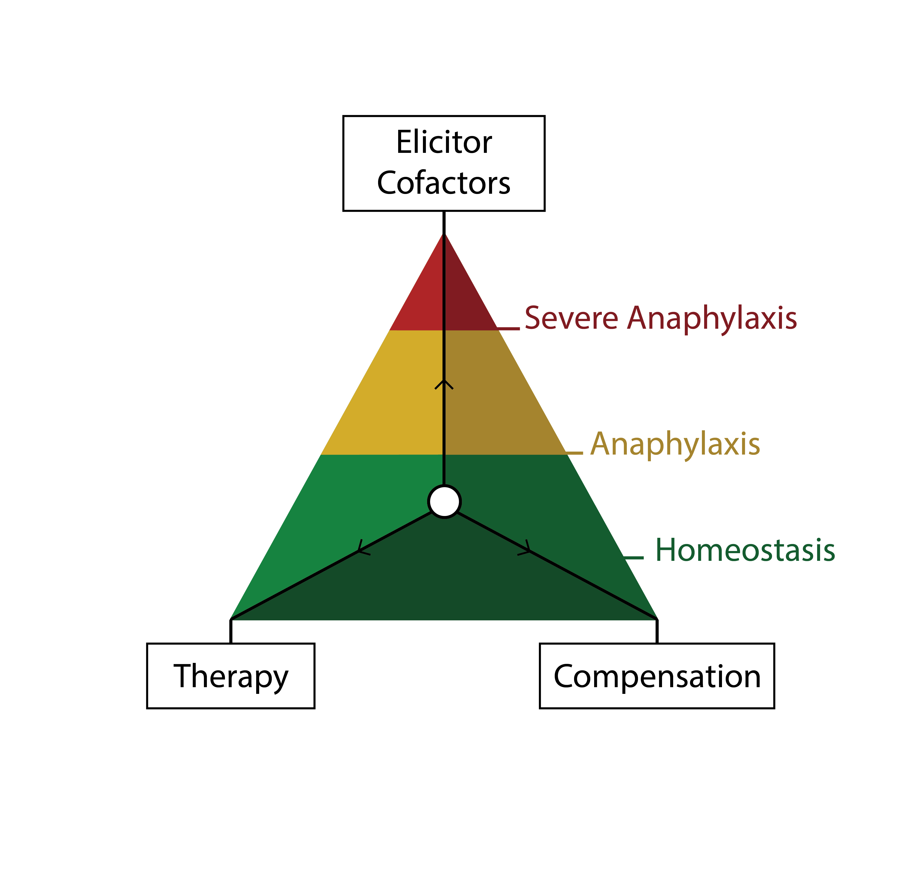

<!-- This is the format for text comments that will be ignored during renderings. Do not put R code in these comments because it will not be ignored. -->

```{r, setup, echo = FALSE,warning=FALSE,message=FALSE}
knitr::opts_chunk$set(
  collapse = TRUE,
  warning = FALSE,
  message = FALSE,
  echo = FALSE,
  comment = "#>",
  fig.path = "../figures/"
)

library(RefractoryAnaOrg) # Or use devtools::load_all('.', quiet = T) if your code is in script files, rather than as functions in the `/R` diretory
require(magrittr)
```

```{r}
periopAna <- data3$rANA[which(data3$q_152_location=="medical practice, hospital")] %>% 
  as.factor %>%  summary()

```


*Department of Dermatology, Venerology and Allergology, Charité – Universitätsmedizin Berlin, corporate member of Freie Universität Berlin, Humboldt-Universität zu Berlin, and Berlin Institute of Health, Charitéplatz 1, 10117 Berlin,

**Klinik und Poliklinik für Dermatologie und Allergologie, Frauenlobstraße 9–11, 80337 München

**Corresponding author: **
Prof. Dr. med. M. Worm margitta.worm@charite.de
Phone: +49 30 450 529 005;	  Fax: +49 30 450 529 902


**Keywords:** 
anaphylaxis, adrenaline (epinephrine), beta-blockers, insect venom allergy, drug allergic reactions, vasopression, refractory


# Abstract
<!-- 350 Words unstructured -->
Refractory anaphylaxis (unresponsive to treatment with at least 2 doses of minimum 300 mg adrenaline) is a rare and often fatal hypersensitivity reaction. Based on this, its definition, prevalence, and risk factors are only vaguely described.  
Using the data from the European Anaphylaxis Registry (`r v$allCases` cases in total) we were able to identify cases of refractory anaphylaxis (n = `r v$casesR`) and to analyse these in comparison to a control group of severe anaphylaxis cases (n = `r v$casesC`).

The data show that drugs more frequently elicited refractory anaphylaxis (`r elicitorTab["drugs","percent"]`% of cases, p < 0.0001) than in other severe anaphylaxis cases (`r elicitorTab["drugs","percANA"]`%).  Cases elicited by insects (n = `r sum(v$casesInsect)`) were more often due to bees in refractory cases (`r elicitExact[4,3]`% vs `r elicitExact[4,2]`%, p = `r elicitExact[4,4]`). The refractory cases occurred more frequently in a perioperative setting (`r v$perioperative[3]`% vs. `r v$perioperative[2]`, p < 0.0001). Intramuscular adrenaline (as a first line therapy) was administered in `r therapyTab[1,3]`% of refractory cases, whereas in `r therapyTab[2,3]`% of cases was given intravenously (significantly more often than in severe anaphylaxis cases: `r therapyTab[2,2]`%, p < 0.0001). Second line treatment options (e.g. vasopression with dopamine, methylene blue, glucagon) were not used at all in the treatment of refractory cases. The mortality rate in refractory anaphylaxis was significantly higher (`r v$mortality[3]`%) than in severe cases (`r v$mortality[2]`%, p < 0.0001).

Although multiple guidelines on anaphylaxis have been published, the clinical adherence to these guidelines can be improved. The low use of intramuscular adrenaline as a first line therapy might contribute to refractoriness of an episode. Also, the lack of suggested second line medication use in refractory cases indicate that the availability of these drugs is either restricted or anaphylaxis management guidelines may need to be revised to provide clear algorithms for severe refractory anaphylaxis. 


# Introduction

Anaphylaxis is a non-homogeneous clinical diagnosis, depending on various triggering and augmenting factors. This variability introduces a wide range of possible reaction-symptom severities. Therefore multiple sub-types of anaphylaxis have been previously identified (i.e. food dependent exercise induced anaphylaxis, venom anaphylaxis, biphasic anaphylaxis). 

The mainstay of anaphylaxis management is the intramuscular dose of adrenaline, but in the most severe cases of anaphylaxis it might be insufficient to restore a stable patient status. Refractory anaphylaxis (although the established definition is lacking) might be defined as anaphylaxis meeting the criteria by NIAID/FAAN [@Sampson2006] which, after the treatment with at least 2 doses of minimum 300 mg adrenaline, does not respond with an expected normalization of clinical symptoms. Typical elicitors and symptoms of refractory anaphylaxis, as well as the therapeutic strategy for the most severe cases, differ from the usual reactions [@Francuzik2018] and call for a specific research and targeted guideline development for refractory anaphylaxis cases.

We aimed to distinguish the prevalence of refractory anaphylaxis among anaphylaxis cases and to describe its symptoms and factors which may increase the risk of a refractory anaphylaxis episode. 


# Methods
The European Anaphylaxis Registry (described in detail elsewhere [@Grabenhenrich2016]) provided data for this analysis status from May 2018.  We selected cases where patients received at least two doses of adrenaline, and failed to recover adequately and assigned them to the "refractory anaphylaxis group". The flowchart in figure \@ref(fig:flowchart) represents the detailed cases selection process. 

The final database consisted of `r sum(countries)` cases of refractory anaphylaxis from `r length(countries)` countries: `r paste0(names(countries[order(countries,decreasing = T)]),": ",countries[order(countries,decreasing = T)],collapse=", ")`. We compared these to a group of severe, non-refractory cases of anaphylaxis. Severe reactions were identified based on the definition by NIAID/FAAN [@Sampson2006] and presented with significant hypoxia, hypotension, confusion, collapse, loss of consciousness, or incontinence. 
We compared the frequency of various elicitors, symptoms, and factors known to incease the risk of severe anphylaxis [@Worm2018] in both groups. We also compared how the cases were managed.

<!-- ## Data handling and statisitcs -->
The statistical analysis was performed in the R Statistical Package [@R]. Simple comparison of nominal variables was performed using Fischer's exact test, continous variables were analysed using Mann-Whithney U test. We defined statistical significance as α = 0.05. Data along with the analysis script can be accessed at github.com/wolass/RefractoryAnaOrg.

# Results

<!-- ## Demographics -->
## Refractory anaphylaxis accounts for less than 0.5% of severe anaphylaxis cases in the register

The European Anaphylaxis Registry captured `r {data3[,"rANA"]=="yes"} %>% which %>% length` cases of refractory anaphylaxis and `r {data3[,"rANA"]=="no"} %>% which %>% length` severe, non-refractory anaphylaxis. The frequency of refractory anaphylaxis was `r ((data3$rANA=="yes") %>% which() %>% length / (data3$d_year_reaction %in% 2007:2017) %>% which() %>% length ) %>% {.*100} %>% signif(2)`% of all anaphylaxis cases reported in the registry. Each year approximately 1% (`r table(data3$d_year_reaction, data3$rANA) %>% {cbind(.[,1]/(.[,1]+.[,2]),.[,2]/(.[,1]+.[,2]))[which(rownames(.) %in% 2007:2017),2]} %>% {paste0(mean(.) %>% signif(3)*100, "% $\\pm$ ", sd(.) %>% signif(3)*100,"%")}`) of severe anaphylactic episodes are refractory to treatment with adrenaline. When considering patients undergoing a medical procedure (who experience anaphylaxis in a perioperative setting), nearly `r (periopAna[2]/(periopAna[2]+periopAna[1])) %>% signif(3)*100`% (`r (periopAna[2]/(periopAna[2]+periopAna[1]) %>% signif(3)*100 / 0.853) %>% signif(3)` times more) patients present with reactions that do not respond to adrenaline. 

## Increased Frequency of previous reactions in patients with refractory anaphylaxis

The mean age at the reaction was `r {data3$d_age[data3[,"rANA"]=="yes"]} %>% mean(na.rm=T) %>% signif(3)` ± `r data3$d_age[data3[,"rANA"]=="yes"] %>% sd(na.rm=T) %>% signif(3)` years, which did not differ from severe, non-refractory cases, p = `r t.test(data3$d_age[data3[,"rANA"]=="yes"],data3$d_age[data3[,"rANA"]=="no"])$p.value %>% signif(3)`).
The percentage of males within the refractory anaphylaxis group was `r (as.numeric(demoTab[2,2])/sum(as.numeric(demoTab[2,2])+as.numeric(demoTab[1,2]))*100) %>% {round(.,1)}`%. Significantly more patients suffered from a concomitant malignant disease in the refractory anaphylaxis group. Most strikingly, patients with refractory reactions more often had a previous anaphylactic reaction in their medical history (p = `r data3$q_410_prev_v5 %>% table(data3$rANA) %>%{.[1:2,]} %>% fisher.test() %>% {.$p.value} %>% signif(3)`).
The demographic summary of refractory cases is shown in table \@ref(tab:demoTab). 

<!-- # ## Elicitors -->
## Drugs are the most frequent elicitors of refractory anaphylaxis

```{r}
locTab <- data3$q_152_location %>% table(data3$rANA)
 # data3$rANA[which(data3$q_152_location=="medical practice, hospital")] %>% as.factor %>%  summary()
```

Refractory anaphylaxis was most commonly elicited by drugs (significantly more often than in severe, non-refractory cases), followed by food and insects (table \@ref(tab:elicitorTab)). The most common drugs eliciting anaphylaxis refractory to adrenaline were antibiotics (`r elicitExact[1,3]`%) and Radio-contrast media (RCM, `r elicitExact[2,3]`%). Patients with refractory anaphylaxis more frequently experienced the reaction while undergoing a medical procedure (`r (locTab[3,2]/sum(locTab[,2])*100) %>% {signif(.,3)}`% vs. `r (locTab[3,1]/sum(locTab[,1])*100) %>% {signif(.,3)}` in severe, non-refractory cases, p < 0.0001) 


`r elicitorTab[1,8]`% of food elicited cases had a previously confirmed diagnosis of food allergy. Severe cases of anaphylaxis were most frequently elicited by insects and food triggers.
Insect-venom-elicited, refractory cases were significantly less often elicited by yellow-jacket-stings (but not by bee-stings) than severe, non-refractory cases (table \@ref(tab:elicitExact)). 

## Refractory anaphylaxis is life-threathening
<!-- ## Symptoms -->
Milder anaphylaxis symptoms (i.e. pruritus, gastrointestinal symptoms, vertigo, chest and throat tightness) were significantly less often present in refractory anaphylaxis cases, whereas respiratory and cardiac arrest, as well as inspiratory and expiratory distress, and death were more often associated with the refractory anaphylaxis cases. Table \@ref(tab:symptTab) summarizes the most prominent differences in anaphylaxis symptoms among both groups.
<!-- ## Death  -->
Fatal reactions frequently occurred 30 minutes to 120 minutes after exposure - when the ardiopulmonary resuscitation was unsuccessful. In cases where patients responded to life support procedures, but failed to be reanimated due to post-resuscitative complication (e.g. hypoxic brain injury), death occured in the next 3-8 days. 

<!-- ## Therapy -->
## Adrenaline i.v. as first-line treatment was given frequently in refractory anaphylaxis

```{r}
med.time2 <-data3$q_530_adren2_time_in_min_v5 %>% as.character() %>% as.numeric %>% split(data3$rANA) %>% lapply(median, na.rm=T)
med.timep<- data3$q_530_adren2_time_in_min_v5 %>% as.character() %>% as.numeric %>% 
  {wilcox.test(.[data3$rANA=="no"],.[data3$rANA=="yes"])}
adr2prof <- rcalc("q_530_adren2_who_v5","professional")

```

When evaluating the therapeutic procedures, adrenaline iv. as a first-line treatment of anaphylaxis was significantly more often given in refractory cases (`r therapyTab[2,3]`% vs. `r therapyTab[1,3]`%, p < 0.0001) it has been also given more often as a second line therapy in refractory cases. 
Median time to the second dose of adrenaline was also shorter in refractory cases (`r med.time2[[2]]` minutes vs. 15 minutes in non-refractory cases, p = `r med.timep$p.value %>% signif(3)`). <!--  wilcox.test(data3$q_530_adren2_time_in_min_v5[data3$rANA=="yes"],data3$q_530_adren2_time_in_min_v5[data3$rANA=="no"])$p.value %>% signif(3)--> 
<!--In `r adr2prof[3]`% of refractory cases, the second dose of adrenaline was given by a professional (significantly more than in non-refractory cases `r adr2prof[2]`%, p < 0.0001).  -->

Corticosteroids i.v. were the second most frequently administered group of drugs in refractory cases (as a first and second line treatment), outpacing antihistaminic drugs and volume replacement therapy, and were significantly more often given in refractory cases. Volume replacement therapy was given initially in `r therapyTab[4,3]`% of refractory cases but was sustained only in `r therapyTab[5,3]`% as the therapy progressed in the hospital environment. 
<!--(possible counfounding variable by patients who died!!! they did not receive second line therapy and might need to be discarded from the analysis)--> 

Second line medication like dopamine, glucagon and methylene blue were neglected in all refractory anaphylaxis cases as well as in severe non-refractory ones, however patients with refractory anaphylaxis were more frequently admitted to the hospital and treated at the ICUs. Table \@ref(tab:therapyTab) illustrates the therapy of refractory anaphylaxis cases.

## Cofactors of refractory anaphylaxis
<!-- ## Cofactors -->
Patients with refractory anaphylaxis more often had concomitant asthma and malignant diseases in the past. Also other unspecified concomitant conditions were significantly more often reported in refractory cases. It is worth noticing that concomitant cardiologic conditions, diabetes and mastocytosis were similarly frequent in both groups.  

Patients with refractory anaphylaxis more often used proton pump inhibitors (PPI) and acetylsalicilic acid (ASA) than patients with severe non-refractory anaphylaxis. Other (not specified) medications were also more frequent in refractory cases. 

The intensity of physical exercise exceeding the reaction was indifferent between groups, however the psychological burden was reported 3 times more frequently in refractory cases (see table \@ref(tab:cofactorsTab)).

```{r}
#data3$q_410_other_codisease_free[which(data3$rANA=="yes")]
#rcalc("q_4212_exercise_intensity","moderate eg. vigorous housework or gardening")
#data3$q_423_other_drug_free[which(data3$rANA=="yes")] 

```


# Discussion

## Frequency and patients at risk
Our findings suggest that around 1 in 100 severe anaphylaxis patients will not respond to the standard therapy with adrenaline, commonly outlined in anaphylaxis management guidelines [@Muraro2014]. Such cases have the highest risk of a fatal outcome, and therefore need to be treated adequately.

Overall, the severity of anaphylaxis and its probable transition into a refractory episode might be described as in the figure \@ref(fig:theory). Patients who undergo anaphylaxis have four main aspects that influence the severity of a particular episode: 1) compensation - how well is the body able to compensate reaction symptoms e.g. hypotension; 2) elicitors - what was the eliciting agent and duration of the exposition; 3) cofactors - is the presence of other factors which may increase the severity of a given reaction i.e. concomitant use of betablocker etc.; 4) therapy - how fast and accurate the therapeutic procedures were introduced.  
<!-- This theory might explain why younger patients are able to better compensate the same trigger which would elicit a refractory reaction in eldery patients.  -->

## Symptom compensation
Age is the most important factor influencing the risk of developing severe anaphylaxis [@Worm2018]. It has been shown that older age may correlate with the decreased abillity to retain homeostasis on strain [@fleg1995].
Patients who underwent refractory anahpylaxis more often had perioperative reactions  and therefore a decreased ablity to compensate the reaction symptoms. 

## Elicitors
Drugs were the most commonly occurring elicitor, what is in concordance with our previous findings [@Francuzik2018]. Multiple medications given in a perioperative setting increase the chance of a hypersensitivity reaction and drug interactions. Perioperative cases of refractoriness have been previously published to be the most common in case series analysis [@Francuzik2018]. Therefore patients who undergo medical procedures and have a history of anaphylaxis should remain under special caution. 

Antibiotics, although commonly triggering type IV hypersensitivity reactions, are rarely reported in the literature as the cause of a refractory anaphylaxis. We saw multiple refractory reactions to antibiotics but in clinical practice, these might be overestimated, as patients in a perioperative setting receive multiple drugs along with antibiotics. 

RCM however, commonly elicit hypersensitivity episodes refractory to adrenaline and are responsible for 1-5 deaths per 100,000 administrations  [@Greenberger1991]. RCM was the most frequent elicitor of refractory anaphylaxis.  One of the plausible explanation to this is that RCM promote CARPA and pseudoallergic reactions which might depend on a different mechanism than anaphylaxis [@Wang2011], and therfore the treatment with adrenaline may be less effective in these reactions.

Literature describes many cases of hypersenitivity due to cancer drugs. We saw more cases of refractory anaphylaxis in patient who reported having a malignant disease in the past. Is it possible that the cancer drugs made them more susceptible to refractory anaphylaxis?

```{r}
temp <- data3[data3$rANA=="yes",]
mean_age_malig <- data3$d_age %>% split(data3$q_410_malig_prev_v5 %>% factor) %>% lapply(mean)
```

It also might be that patients with reported malignancies were simply older (mean age of `r mean_age_malig[[1]]` vs `r mean_age_malig[[2]]` p < ) and therefore less able to compensate the anaphylactic shock. 

There were also relatively less refractory cases elicited by yellow jacket stings (but not bee-stings). The question we could ask here is if chemical properties of bee and yellow jacket venom have various affinities to mast cells? Plausible explanations for this observation, might include either longer exposition to the allergen (longer stings predispose to deeper deposition of the venom and slower metabolizing) or more efficient vasodilation due to biochemical differences between wasp and bee venom. [insekt sting anaphylaxis, Golden, 2007]. In such case - patients might benefit from vasopressive medication [source]. 

Mastoparans are a potent family of mast cell activators through G-protein coupled receptors (GPCRs). It is likely that their affinity to GPCRs might vary and the composition of mastoparans might depend on the species [source].  

## Risk factors 
Although we have previously identified older age and male sex to be associated with more severe anaphylaxis [@Worm2018], these factors seem to be less important when refractory anaphylaxis is considered. Asthma and malignant diseases in the medical history were more frequent in the refractory anaphylaxis group and the reason for this is unclear. It is however interesting that past malignant diseases were mostly recognized in male refractory anaphylaxis patients.

We previously saw that concomitant asthma was rather associated with less severe  anaphylaxis [@Worm2018] but the present analysis indicated concomitant asthma as a risk factor for a refractory episode. Either patients receive already antihistaminic and mast cell blocking agents and their reaction to adrenaline is therefore restricted, or the episode elicits a bronchospasm that is refractory to adrenaline and therefore results in a prolonged anaphylactic episode. This would also clarify why we saw more respiratory distress symptoms in the refractory anaphylaxis cases. 


<!-- We have previously proven the role of ASA in increasing the risk of severe anaphylaxis [@].  Could not find the reference -->
The role of PPI however has not been identified as a risk factor, and there are only reports on PPI as elicitors of anaphylaxis. 

<!--Low-Dose Ethanol Alters the Cardiovascular, Metabolic, and Respiratory Compensation for Severe Blood Loss-->


## Therapy 
<!-- After revising the therapeutic procedures we saw significantly more adrenaline use in the refractory cases, but it could have been used even more extensively in these life-threatening reactions. This observation might indicate that in fact the emergency teams are using these life-saving measures too cautiously.  -->


Adrenaline i.v. as first-line therapy use was higher in the refractory cases, probably due to most of them happening in a medical setting, however, other second-line therapeutic options were rarely used. 

Methylene blue and vasopressors have been described to successfully restore refractory hypotension, but their actual use in anaphylaxis patients is scarce, although they are mentioned in recognized guidelines on the management of anaphylaxis [@Muraro2014].

## Limitations and strength
Low number of refractory cases prevented us from analyzing the data with more advanced statistical models, however, our analysis is the first published report on over 30 refractory anaphylaxis cases.

Definition  of refractory anaphylaxis is not universal, and confirming the refractory anaphylaxis based on the answers to our online questionnaire poses additional difficulties.
If fatal reaction occurs before the second dose of adrenaline could be administered to the patient - it cannot be diagnosed as refractory (as we defined at least two doses of minimum 300 µg adrenaline) although it as well could be refractory. 

Comparison of refractory anaphylaxis to patients with severe anaphylaxis gave us the possibility to describe which patients have a higher risk of developing a refractory episode, however we can not answer the question which patients have the higher risk of developing anaphylaxis per se. 

## Conclusion

Refractory anaphylaxis is a rare form of life-threatening hypersensitivity reaction with high mortality. We propose to increase the use of second line medication such as methylene blue, vasopressin and glucagon
in cases where 2 doses of adrenaline did not result in rapid normalization of anaphylaxis symptoms. 


# Acknowledgements
We thank the members of The European Anaphylaxis Registry.
<!-- The following line inserts a page break when the output is MS Word. For page breaks in PDF, use \newpage on its own line.  -->

##### pagebreak

# References 
<!-- The following line ensures the references appear here for the MS Word or HTML output files, rather than right at the end of the document (this will not work for PDF files):  -->
<div id="refs"></div>

##### pagebreak


# Figures

```{r flowchart, fig.cap="Flowchart illustrating the cases selection process for the final database."}
knitr::include_graphics("../figures/flow.png")
```


```{r theory, fig.cap="Visual representation of the three forces determining the severity of anaphylaxis. The natural ability of the body to compensate the anaphylaxis symptoms and therapeutic measures act to restore homeostasis to a patient by whom elicitors and cofactors influence synergistically the severity of a given episode."}


```

# Tables

```{r demoTab}
knitr::kable(demoTab, caption = "Summary of the refractory anaphylaxis cases. Age is represented by a mean value, other as fractions [%]. DM - diabetes mellitus",)
```

```{r elicitorTab}
knitr::kable(elicitorTab, caption = "Summary of elicitors in the refractory anaphylaxis cases and severe, non-refractory anaphylaxis cases as a control. ANA - anaphylaxis, p-value derived from the Fisher exact test.",
             col.names = c("n","refractory ANA [%]","severe ANA [%]","p value","Age","Male sex [%]","Perioperative [%]","Food allergy [%]"),
             digits = 1)
```


```{r elicitExact}
knitr::kable(cbind(elicitExact[,5],elicitExact[,2:4]), caption = "Summary of the elicitors broken down to specific elicitors from each group in the refractory anaphylaxis cases and severe anaphylaxis cases as a control. ANA - anaphylaxis, p-value derived from the Fisher exact test. ",
             col.names = c("Elicitor","severe ANA [%]","refractory ANA [%]","p value"))
```

p-value derived from the Fisher exact test. 

```{r symptTab}
knitr::kable(symptTab[,1:4], caption = "Summary of the symptoms in the refractory anaphylaxis cases and severe, non-refractory anaphylaxis cases as a control. ANA - anaphylaxis, p-value derived from the Fisher exact test. ",
             col.names = c("Symptom","severe ANA [%]","refractory ANA [%]","p value"))
```


```{r therapyTab}
knitr::kable(therapyTab[,1:4], caption = "Summary of therapeutic measures in the refractory anaphylaxis cases and severe, non-refractory anaphylaxis cases as a control. 2nd line therapy was performed after the initial rescue individual called for a professional medical emergeny team. ANA - anaphylaxis, p-value derived from the Fisher exact test. ",
             col.names = c("Therapy","severe ANA [%]","refractory ANA [%]","p value"))
```

```{r cofactorsTab}
knitr::kable(cofactorsTabF[,1:4], caption = "Factors potentially increasing the risk of a severe anaphylaxis investigated in refractory cases. ANA - anaphylaxis, p-value derived from the Fisher exact test. ",
             col.names = c("Factor","severe ANA [%]","refractory ANA [%]","p value"))
```


