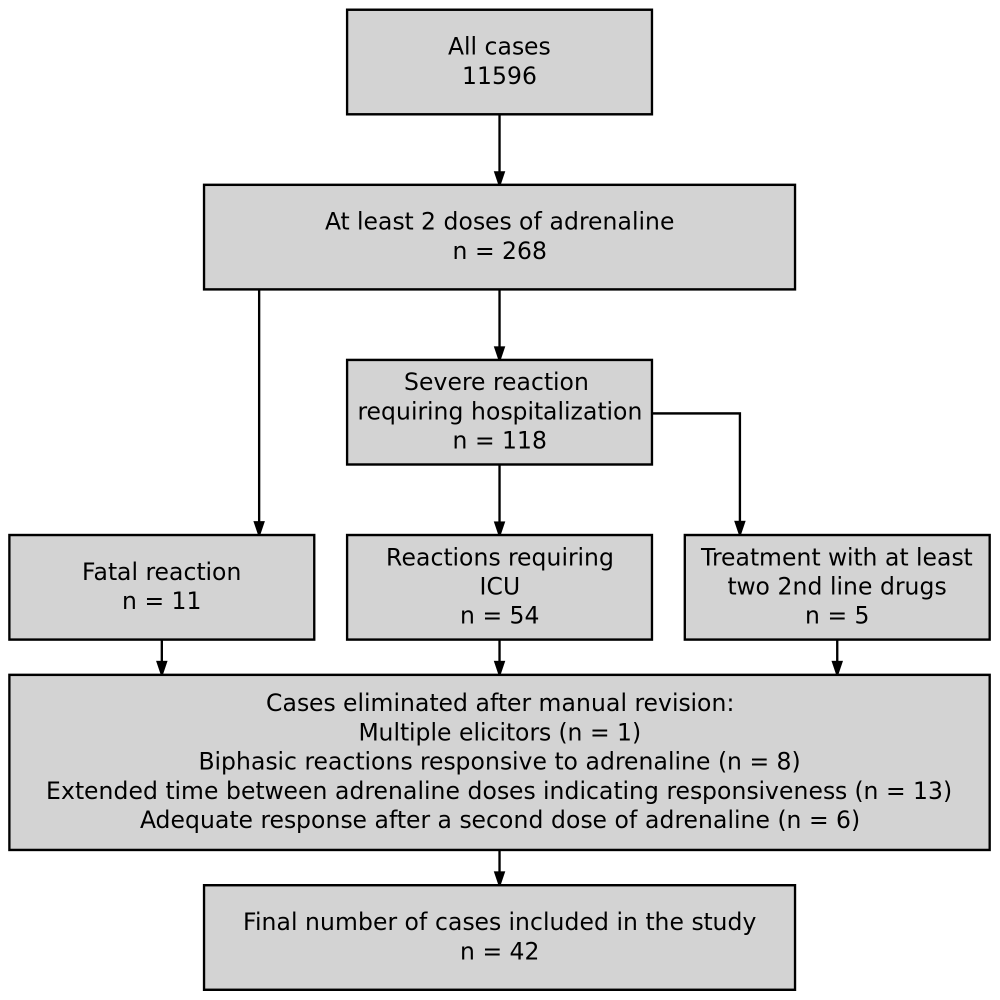

<!-- This is the format for text comments that will be ignored during renderings. Do not put R code in these comments because it will not be ignored. -->

```{r, setup, echo = FALSE,warning=FALSE,message=FALSE}
knitr::opts_chunk$set(
  collapse = TRUE,
  warning = FALSE,
  message = FALSE,
  echo = FALSE,
  comment = "#>",
  fig.path = "../figures/"
)

library(RefractoryAnaOrg) # Or use devtools::load_all('.', quiet = T) if your code is in script files, rather than as functions in the `/R` diretory
require(magrittr)
```


Department of Dermatology, Venerology and Allergology, Charité – Universitätsmedizin Berlin, corporate member of Freie Universität Berlin, Humboldt-Universität zu Berlin, and Berlin Institute of Health, Charitéplatz 1, 10117 Berlin,

**Corresponding author: **
Prof. Dr. med. M. Worm margitta.worm@charite.de
Phone: +49 30 450 529 005;	  Fax: +49 30 450 529 902


**Keywords:** 
anaphylaxis, adrenaline (epinaphrine), Betablockers, Insect venom allergy, Drug allergic reactions


# Abstract: 
<!-- 350 Words unstructured -->
Refractory anaphylaxis (unresponsive to treatment with at least 2 doses of minimum 300 mg adrenaline) is a rare and often fatal hypersensitivity reaction. Its definition, prevalence, and risk factors are only vaguely described.  
Using the data from the European Anaphylaxis Registry (`r v$allCases` cases in total) we were able to identify cases of refractory anaphylaxis (n = `r v$casesR`) and compare them to a control group of severe anaphylaxis cases (n = `r v$casesC`).
Drugs significantly more frequently elicited refractory anaphylaxis (`r elicitorTab["drugs","percent"]`% of cases) than in other severe anaphylaxis cases (`r elicitorTab["drugs","percANA"]`%).  Cases elicited by insects (n = `r sum(v$casesInsect)`) were more often due to bees in refractory cases (`r elicitExact[4,3]`% vs `r elicitExact[4,2]`%, p = `r elicitExact[4,4]`). The refractory cases occurred more frequently in a perioperative setting (`r v$perioperative[3]`% vs. `r v$perioperative[2]`, p < 0.0001). Intramuscular adrenaline (as a first line therapy) was administered in `r therapyTab[1,3]`% of refractory cases, whereas in `r therapyTab[2,3]`% of cases was given intravenously (significantly more often than in severe anaphylaxis cases: `r therapyTab[2,2]`%, p < 0.0001). Second line treatment options: vasopression with dopamine, methylene blue, glucagon i.v. were not used at all in the treatment of refractory cases. Mortality rate in refractory anaphylaxis was significantly higher (`r v$mortality[3]`%) than in severe cases (`r v$mortality[2]`%, p < 0.0001).
Although multiple guidelines on anaphylaxis have been published, the clinical adherence to these standards leaves room for improvement. Low use of intramuscular adrenaline as a first line therapy might contribute to refractoriness of an episode. Also, lack of suggested 2nd line medication use in refractory cases indicate that availability of these drug is restricted or anaphylaxis management guidelines may need revision in order to provide algorithms for severe refractory anaphylaxis. 

# Introduction: 
The mainstay of Anaphylaxis management is the intramuscular dose of adrenaline, but in the most severe cases of anaphylaxis it might insufficient to restore a stable patient status. 

Refractory anaphylaxis (although the established definition is lacking) might be defined as anaphylaxis meeting the criteria by NIAID/FAAN [@Sampson2006] which is unresponsive to the treatment with at least 2 doses of minimum 300 mg adrenaline (lack of expected normalization of clinical symptoms). 

# Methods
We aimed to distinguish the prevalence of refractory anaphylaxis among anaphylaxis cases and factors which may increase the risk of a refractory anaphylaxis episode. 
Using the Data from the European Anaphylaxis Registry we selected cases where patients received at least two doses of adrenalin, and failed to recover adequately. The flowchart represents the detailed cases selection process. 

The final database consisted of `r sum(countries)` cases from `r length(countries)` countries: `r paste0(names(countries),": ",countries,collapse=", ")`.


# Results

The European Anaphylaxis Registry contained `r data3[,1] %>% length` cases of anaphylaxis and in `r sum(sumAdre[3:6])` cases at lest 2 doses of adrenalin were administered to the patient. 


```{r get-data, eval = FALSE}
# Note the path that we need to use to access our data files when rendering this document
my_data <- readr::read_csv("../data/raw_data/my_csv_file.csv")
```

# Discussion

# Conclusion

# Acknowledgements

<!-- The following line inserts a page break when the output is MS Word. For page breaks in PDF, use \newpage on its own line.  -->
##### pagebreak

# References 
<!-- The following line ensures the references appear here for the MS Word or HTML output files, rather than right at the end of the document (this will not work for PDF files):  -->
<div id="refs"></div>

##### pagebreak


# Figures

```{r flowchart, fig.cap="Flowchart illustrating the cases selection process for the final database."}

```


# Tables

```{r demoTab}
knitr::kable(demoTab, caption = "Summary of the refractory anaphylaxis cases. ")
```

```{r elicitorTab}
knitr::kable(elicitorTab, caption = "Summary of elicitors in the refractory anaphylaxis cases and severe anaphylaxis cases as a control. ",
             col.names = c("n","refractory ANA [%]","severe ANA [%]","p value","Age","Male sex [%]","Perioperative [%]","Food allergy [%]"))
```


```{r elicitExact}
knitr::kable(cbind(elicitExact[,5],elicitExact[,2:4]), caption = "Summary of elicitors in the refractory anaphylaxis cases and severe anaphylaxis cases as a control. ",
             col.names = c("Elicitor","severe ANA [%]","refractory ANA [%]","p value"))
```

* p-value derived from the Fischer exact test. 

```{r therapyTab}
knitr::kable(therapyTab[,1:4], caption = "Summary of therapeutic measures in the refractory anaphylaxis cases and severe anaphylaxis cases as a control. ",
             col.names = c("Therapy","severe ANA [%]","refractory ANA [%]","p value"))
```

* p-value derived from the Fischer exact test. 


